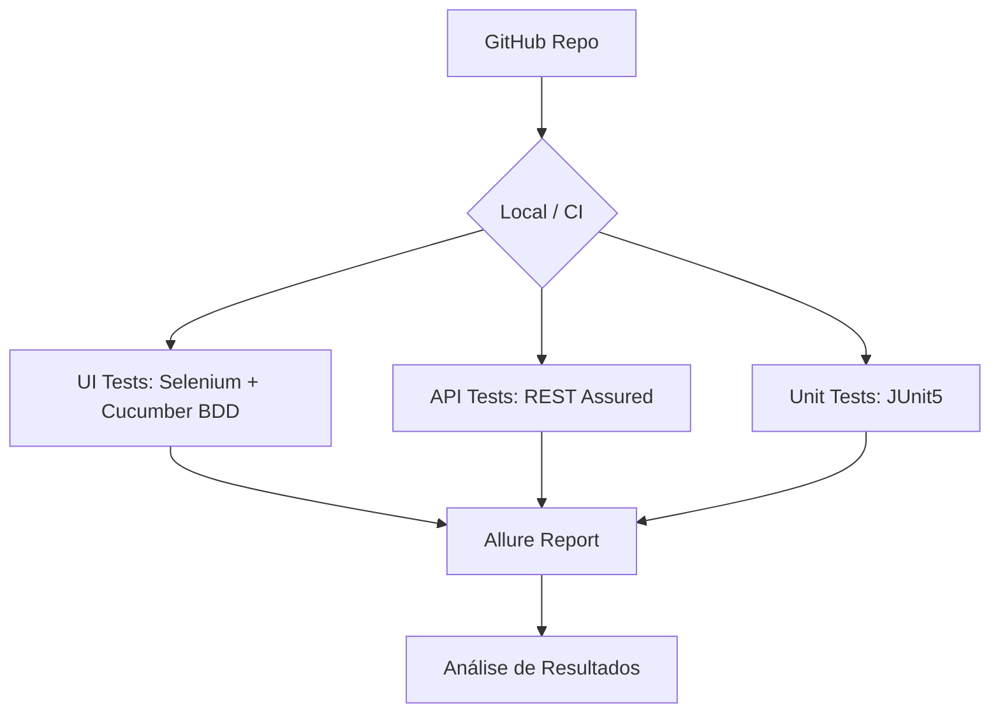

# ☕ Selenium Java BDD — Automação E2E com Selenium 4 + Java 17 + Cucumber


Projeto de automação de testes com **Selenium 4 + Java 17 + Cucumber 7 + JUnit5 + Allure + Maven**, cobrindo cenários de UI e API REST com **REST Assured**.

---

## 🏗️ Arquitetura do Projeto



---

## 📋 Índice

- [Tecnologias Utilizadas](#-tecnologias-utilizadas)
- [Pré-requisitos](#-pré-requisitos)
- [Instalação e Configuração](#-instalação-e-configuração)
- [Executando os Testes](#-executando-os-testes)
- [Estrutura do Projeto](#-estrutura-do-projeto)
- [Casos de Teste Cobertos](#-casos-de-teste-cobertos)
- [Relatórios de Teste](#-relatórios-de-teste)

---

## 🛠 Tecnologias Utilizadas

| Tecnologia | Versão | Descrição |
|---|---|---|
| **Java** | 17 | Linguagem principal |
| **Selenium** | 4.27.0 | WebDriver para testes de UI |
| **WebDriverManager** | 5.9.2 | Gerenciamento automático de drivers |
| **Cucumber** | 7.14.0 | BDD com Gherkin em Português |
| **JUnit5** | 5.10.0 | Framework de testes |
| **Allure** | 2.24.0 | Relatórios de testes detalhados |
| **REST Assured** | 5.4.0 | Testes de API REST |
| **Maven** | 3.x | Build e gerenciamento de dependências |

---

## ✅ Pré-requisitos

- [Java JDK](https://adoptium.net/) versão 17 ou superior
- [Maven](https://maven.apache.org/) versão 3.8+
- [Google Chrome](https://www.google.com/chrome/) instalado

---

## 🚀 Instalação e Configuração

1. **Clone o repositório:**
```bash
git clone https://github.com/Rafael-M-Sales/selenium-java-bdd-automation.git
cd selenium-java-bdd-automation
```

2. **Compile o projeto:**
```bash
mvn clean compile
```

---

## ▶️ Executando os Testes

### Executar todos os testes
```bash
mvn test
```

### Executar por tag
```bash
mvn test -Dcucumber.filter.tags="@login"
mvn test -Dcucumber.filter.tags="@api"
mvn test -Dcucumber.filter.tags="@happy-path"
```

### Gerar e abrir relatório Allure
```bash
mvn allure:report
mvn allure:serve
```

---

## 📁 Estrutura do Projeto

```
selenium-java-bdd/
├── src/
│   ├── main/
│   │   └── java/
│   │       └── utils/
│   │           └── StringUtils.java       # Utilitários de string
│   └── test/
│       ├── java/
│       │   ├── hooks/
│       │   │   └── Hooks.java             # WebDriver lifecycle
│       │   ├── pages/
│       │   │   └── LoginPage.java         # Page Object
│       │   ├── runner/
│       │   │   └── TestRunner.java        # Ponto de entrada Cucumber
│       │   ├── steps/
│       │   │   ├── LoginSteps.java        # Steps de login
│       │   │   └── ApiSteps.java          # Steps de API
│       │   └── unit/
│       │       └── StringUtilsTest.java   # Unit tests JUnit5
│       └── resources/
│           ├── features/                  # Gherkin pt-BR
│           │   ├── login.feature
│           │   └── api.feature
│           └── allure.properties
└── pom.xml
```

---

## 👨‍🏫 Foco Educativo e Didático

Este projeto segue as melhores práticas de engenharia de QA:
- **Page Object Model (POM)**: Separação clara entre a lógica de interação e os cenários de teste.
- **Hooks de Teste**: Configuração e limpeza automática do estado do navegador.
- **Testes Unitários**: Cobertura de utilitários com JUnit5.
- **Relatórios Allure**: Visualização rica e detalhada dos resultados.

---

## 🧾 Casos de Teste Cobertos

### 🌐 Automação E2E + API

| # | Tag | Funcionalidade | Alvo |
|---|---|---|---|
| 1 | `@login` | Cenários de login | the-internet.herokuapp.com |
| 2 | `@api` | Testes de API REST (REST Assured) | reqres.in |
| 3 | `@happy-path` | Fluxos de sucesso | - |
| 4 | `@sad-path` | Fluxos de erro | - |
| 5 | `@logout` | Cenários de logout | - |
| 6 | `@crud` | Operações CRUD na API | - |

---

## 👤 Autor

**Rafael M. Sales**

---

## 📄 Licença

Este projeto está sob a licença MIT.
